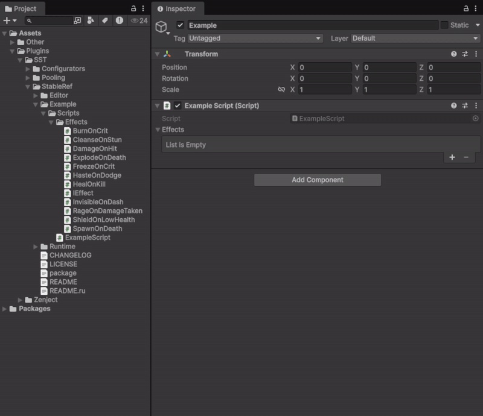
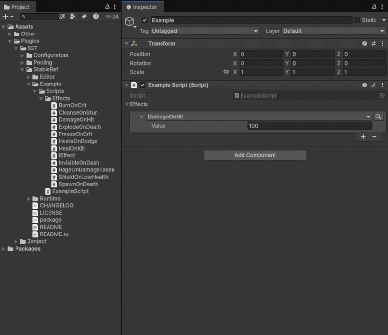
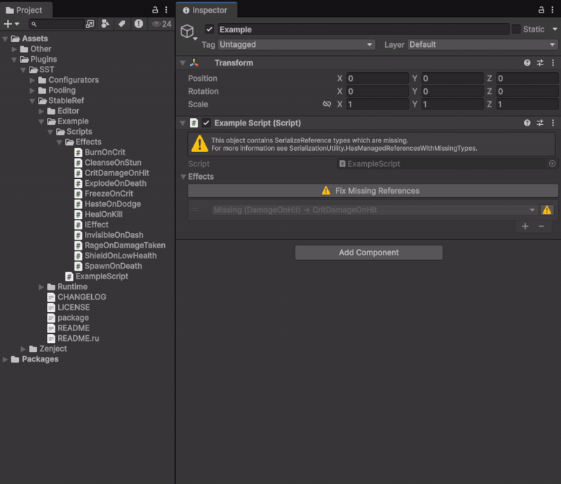

[](../../releases)
[](../../releases)
[](../../commits)
[](LICENSE.md)

[English](README.md) | **Русский**

---

Удобная и надёжная обёртка над `[SerializeReference]` в Unity.

StableRef делает работу с полиморфными сериализованными ссылками стабильной и комфортной: поиск по типам в селекторе инспектора, безопасные копирование/вставка и инструменты редактора для поиска и починки ссылок. Вдобавок ссылки переживают переименование классов — рядом с объектом хранится стабильный строковый ID типа, поэтому переименование или перемещение класса не разрушает уже сохранённые данные.

## Содержание

<details>
<summary>Развернуть</summary>

- [Установка](#установка)
- [Проблема, которую это решает](#проблема-которую-это-решает)
- [Классы и атрибуты](#классы-и-атрибуты)
- [Использование](#использование)
  - [Объявление стабильного типа](#объявление-стабильного-типа)
  - [StableRef\<T\> в поле](#stablerefт-в-поле)
  - [StableRefList\<T\>](#stablereflistt)
  - [Обобщённые типы значений](#обобщённые-типы-значений)
- [Автоматическая генерация ID](#автоматическая-генерация-id)
- [Инструменты редактора](#инструменты-редактора)
- [Копирование и вставка](#копирование-и-вставка)
- [Лицензия](#лицензия)

</details>

---

## Установка

1. **.unitypackage** — [Releases](https://github.com/SST-Systems/StableRef/releases)
2. **UPM** — `Window → Package Manager` → `+` → `Add package from git URL`:
   `https://github.com/SST-Systems/StableRef.git`
   Добавь `#тег` в конец URL для фиксации версии.
3. **Вручную** — склонируй или скачай, скопируй в `Assets/`.

Unity 2021.3+

---

## Проблема, которую это решает

Стандартный `[SerializeReference]` хранит полное assembly-qualified имя типа. Если переименовать или переместить класс, Unity теряет ссылку и поле становится `null`. `StableRef` разделяет сериализованную идентичность и имя класса — тип получает постоянный ID через `[StableTypeId]`, и можно переименовывать его свободно.

---

## Классы и атрибуты

| Тип | Назначение |
|---|---|
| `StableRef<T>` | Сериализуемая обёртка для одиночной полиморфной ссылки типа `T`. |
| `StableRefList<T>` | Сериализуемый список элементов `StableRef<T>`. |
| `[StableTypeId("id")]` | Присваивает классу постоянный ID. Переименовывай класс как угодно — Unity его найдёт. |
| `[StableRefCategory("Path")]` | Группирует тип под подменю в инспекторном селекторе. |

---

## Использование

### Объявление стабильного типа

```csharp
[Serializable]
[StableTypeId("my-package.damage-on-hit")]
[StableRefCategory("Combat")]
public class DamageOnHit : IEffect
{
    public int Amount;
}
```

Значение `[StableTypeId]` должно быть уникальным в проекте. Используй строки с неймспейсом, чтобы избежать коллизий.

### StableRef\<T\> в поле

```csharp
[Serializable]
public class ItemConfig : ScriptableObject
{
    public StableRef<IEffect> OnPickup;
}
```

### StableRefList\<T\>

```csharp
[Serializable]
public class AbilityConfig : ScriptableObject
{
    public StableRefList<IEffect> Effects;
}

// Перебор
foreach (var stableRef in config.Effects)
{
    var effect = stableRef?.Value;
    if (effect != null)
        effect.Apply();
}
```

`StableRefList<T>` также работает как `List<T>` из кода — `Add`, `Insert`, `Remove`, `RemoveAt`, `RemoveAll`, `Clear`, `Contains`, `IndexOf`, `Find` и т.д.:

```csharp
config.Effects.Add(new DamageOnHit { Amount = 5 });
config.Effects.RemoveAll(e => e is DamageOnHit);
```

Индексатор и `foreach` возвращают обёртку `StableRef<T>` (значение — через `.Value`); методы поиска и мутации работают напрямую с `T`. `Items` открывает внутренний `List<StableRef<T>>` для полного `List`-API.

Если список формируется **из editor-скрипта**, а не через инспектор, вызови `StableRefSync.AssignIds(list)` перед сохранением, чтобы новые элементы получили стабильные ID (в инспекторе это происходит автоматически при отрисовке поля).

<p align="center">
  
</p>

### Обобщённые типы значений

Селектор поддерживает и закрытые generic-типы элемента. Для поля вида `StableRefList<ICondition<Unit>>` предлагаются открытые generic-определения, которые ему подходят (например, `All<TContext>`, `Any<TContext>`), закрытые аргументом самого поля (`All<Unit>`). Каждому типу-аргументу нужен свой стабильный ID — свой файл или `[StableTypeId]`, как и любому другому типу StableRef.

---

## Автоматическая генерация ID

`[StableTypeId]` — опционален. Если атрибут не указан, StableRef автоматически использует **MonoScript GUID** (значение поля `guid` из `.meta`-файла скрипта) в качестве стабильного идентификатора. Это значит:

- **Переименование класса** — безопасно. GUID привязан к файлу, а не к имени класса.
- **Переименование или перемещение файла скрипта** — тоже безопасно. Meta-файл переезжает вместе с ассетом, GUID не меняется.
- **Удаление и повторное создание файла** — ссылка теряется (резолвится в `null`), но ошибка обрабатывается контролируемо. Проект продолжит работать; потерянный тип отобразится в Fix Missing Types.

Для типов, которые планируется активно рефакторить, явный `[StableTypeId]` надёжнее — он выживает даже при удалении и пересоздании файла скрипта.

> **Важно:** нельзя размещать несколько классов в одном файле скрипта. Автоматическая генерация ID опирается на MonoScript GUID, который присваивается файлу, а не классу, — при нескольких классах в одном файле генерация ID будет работать некорректно.

---

## Инструменты редактора

Все инструменты доступны через **Tools → StableRef** в строке меню Unity.

**Find Usages** (`Tools/StableRef/Find Usages`) — сканирует префабы, открытые сцены и скриптовые объекты и показывает все места, где используется выбранный тип. Также доступно через правый клик на ассете скрипта: `Assets/Find StableRef Usages`.

<p align="center">
  
</p>

**Fix Missing Types** (`Tools/StableRef/Fix Missing Types`) — сканирует проект в поисках StableRef-полей, чей ID больше не соответствует ни одному известному типу. Удобно после рефакторинга — позволяет найти сломанные ссылки до того, как они превратятся в молчаливую потерю данных.

<p align="center">
  
</p>

---

## Копирование и вставка

Встроенные в Unity **Copy Component** / **Paste Component Values** не всегда корректно обрабатывают данные `[SerializeReference]` при переносе между разными сериализованными документами (например, со сцены в префаб). Это может оставить повреждённую запись в `managedReferences`, из-за которой в консоли появляется ошибка вида:

```
Could not update a managed instance value at property path 'managedReferences[...]', with value '...'
```

Эта ошибка может не пропадать даже после перезапуска редактора и **не** исчезает при откате (revert) компонента — повреждение уже записано в сериализованный файл.

Чтобы безопасно переносить значения `StableRef<T>` / `StableRefList<T>`, используй встроенное контекстное меню по правому клику вместо стандартного копирования/вставки компонента:

| Пункт меню | Где вызывать (ПКМ) | Что делает |
|---|---|---|
| `StableRef/Copy` | Одиночное поле `StableRef<T>` | Копирует текущее значение во внутренний буфер. |
| `StableRef/Paste` | Одиночное поле `StableRef<T>` совместимого типа | Создаёт новую managed reference в целевом поле. |
| `StableRef/Duplicate` | Элемент `StableRef<T>` внутри списка | Вставляет копию сразу после этого элемента. |
| `StableRef/Copy` | Заголовок `StableRefList<T>` (или массив `StableRef<T>`) | Копирует все элементы списка. |
| `StableRef/Paste/Replace` или `StableRef/Paste/Append` | Заголовок `StableRefList<T>` (или массив `StableRef<T>`) | Заменяет или добавляет скопированные элементы. |

Это безопасно между GameObject'ами, префабами и сценами: вместо копирования сырых сериализованных байт создаётся новая managed reference прямо в целевом документе, поэтому `managedReferences` не повреждается.

При копировании компонента со StableRef-полями между сценой и префабом используй это меню именно для StableRef-полей, а не стандартный Copy Component / Paste Component Values.

> **Предупреждение:** даже с этим меню под рукой сохраняй бдительность. Поля на основе `[SerializeReference]` (в том числе `StableRef`/`StableRefList`) не всегда очевидным образом копируются или переносятся даже при тривиальных встроенных операциях Unity — Duplicate, drag & drop в Hierarchy, Apply/Revert префаб-оверрайдов, слияние сцен/префабов и похожих действиях. Перед массовыми изменениями делай коммит или бэкап и проверяй результат после операции.

---

## Лицензия

Распространяется под [MIT License](LICENSE.md). Свободно для использования в личных и коммерческих проектах.

Автор — **Egor Shesterikov**.
